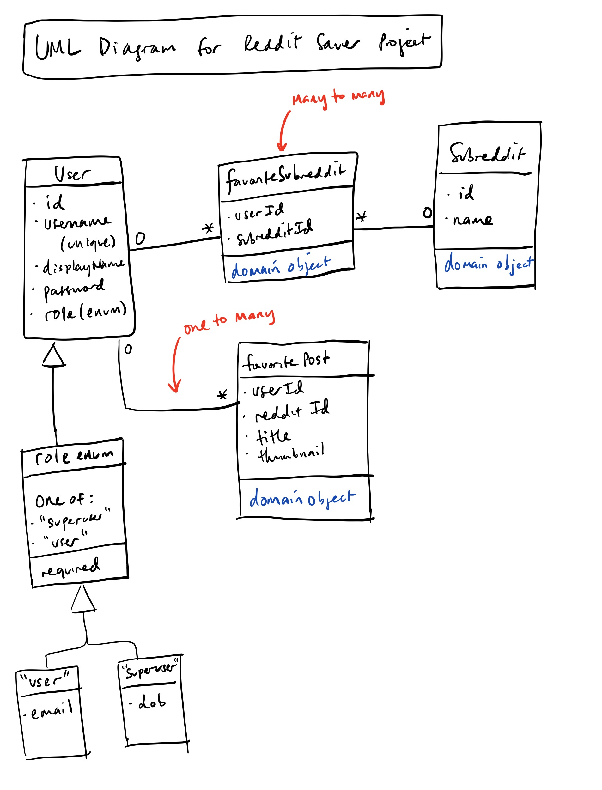

# wbdv-sp21-01-harrisonjwong-project

## Google Document for P1 - Form Teams & Project Description

https://docs.google.com/document/d/10NUcvSCycvWxWx3ySBelb33Rvb9RA8lr300EHq0h8XQ/edit?usp=sharing

## Link to Wiki for P2 - Project Prototype

https://github.com/harrisonjwong/wbdv-sp21-01-harrisonjwong-project/wiki/PROTOTYPE

## CS 5610 SP21 Final Project - Frontend Repo

Note: This repo contains the frontend. 
The backend is at https://github.com/harrisonjwong/wbdv-sp21-01-harrisonjwong-project-backend.
Both are required to run the app.

Uses React with font awesome, react-router, bootstrap

## Instructions

1. Clone the repo
2. `npm install`
3. `npm start`

## UML

